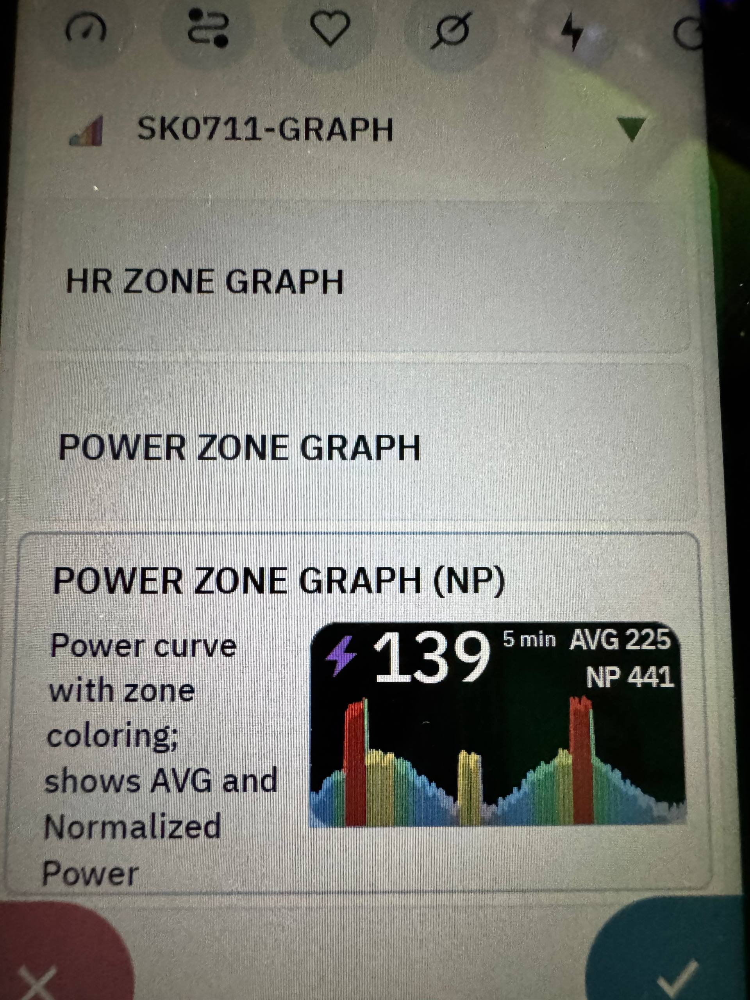
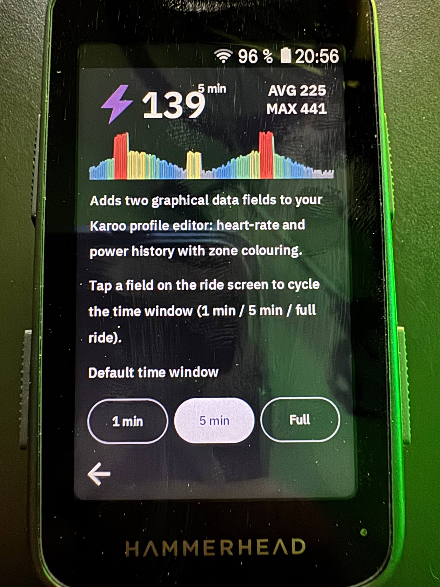

# Changelog

All notable changes to this extension are documented here.
Format based on [Keep a Changelog](https://keepachangelog.com/en/1.1.0/); this project uses semantic versioning.

## [0.1.5] — 2026-04-26

### Added
- **Power Zone Graph (NP)** — a second power data field that shows AVG and **Normalized Power** instead of MAX. Picked from the Karoo profile editor like any other field; user chooses which variant to place. Original "Power Zone Graph" with AVG/MAX is unchanged.

  

- **Default time-window setting** — picker in the app's preview screen (1 min / 5 min / Full). The chosen value is persisted via DataStore and applied at service start to both HR and Power fields. The on-ride tap-toggle still cycles freely from there.

  

### Changed
- `GraphRenderer.render` accepts a `maxLabel` argument (default `"MAX"`); the NP variant passes `"NP"`. Existing call sites unaffected by the default.

## [0.1.4] — 2026-04-23

### Added
- Redesigned app preview screen: shows live HR and Power graphs with their window labels plus a short usage hint. The page is scrollable and has a small back-arrow touch target at the bottom-left.
- App launcher icon refreshed.

### Changed
- Graph current-value text and AVG/MAX labels switched from Roboto Bold to Roboto Regular for a cleaner look.

### Fixed
- Tap-to-toggle time window on the ride screen is reliable again. Each field now uses a unique broadcast action (`ACTION_TOGGLE_HR`, `ACTION_TOGGLE_POWER`) with a cached `PendingIntent` and a manifest-declared `BroadcastReceiver` — pattern borrowed from Karoo-KSafe. Click target is the inner `ImageView` (not a wrapper) and is only attached when `config.preview == false`, so long-press-to-rearrange on the Karoo profile editor keeps working.
- Window label (1 min / 5 min / Full) no longer overlaps the current value or AVG/MAX at narrow field heights — it shrinks to fit the available space between the two columns and is omitted entirely below a minimum readable size.

## [0.1.3] — 2026-04-19

### Added
- AVG and MAX now read directly from Karoo's own `AVERAGE_HR` / `MAX_HR` / `AVERAGE_POWER` / `MAX_POWER` streams, so the values shown on the graph field match other data fields on the page that display the same metric.
- Ride-state awareness: while the ride is paused (manual or auto-pause via `RideState.Paused`), new samples are no longer appended to the curve.

### Changed
- Sample buffer and power smoother are now held on the `DataTypeImpl` instance and collection runs on a service-scoped coroutine. Theme changes (dark/light) no longer restart the collector, so the already-drawn curve survives the switch.
- Re-render trigger is a `StateFlow` signal from the collector to the view, decoupling collection from the view lifecycle.

### Fixed
- Dark/light theme toggle wiped the already-drawn curve (curve was bound to the view's coroutine scope, which was torn down on configuration change).
- Curve continued to be extended during auto-pause, making the "Full" view misrepresent the actual ride.

## [0.1.2] — 2026-04-18

### Added
- Tap on a zone graph field cycles the time window (1 min → 5 min → Full). Implemented via `RemoteViews.setOnClickPendingIntent` on the ImageView; a broadcast reaches the extension service, which advances the per-field `StateFlow<TimeWindow>`.

### Changed
- HR and Power fields now hold **independent** time-window state — toggling one does not affect the other.
- Graph renderer dynamically shrinks the current value text when a narrow field layout would cause it to collide with AVG/MAX.
- Window label (1min/5min/Full) is centered above the graph between the current value and the AVG/MAX column; it is omitted if the available space is too tight rather than overlapping other elements.

### Removed
- Hardware-button-mapped `BonusAction`s for window toggling (replaced by the tap gesture).

### Fixed
- `onBonusAction` override compile error on SDK < 1.1.7 (now moot — BonusActions removed).
- Overlap of the current value and AVG/MAX at certain field heights/widths.

## [0.1.1] — 2026-04-18 (internal, never shipped)

### Added
- Karoo service integration: `HrPowerExtension` service + `HrZoneGraphDataType` / `PowerZoneGraphDataType` data types.
- Live streaming of `HEART_RATE`/`POWER` values combined with `HR_ZONE`/`POWER_ZONE` classification.
- 3-second rolling average for power (`PowerSmoother`).
- Experimental `BonusAction` declarations (later dropped in 0.1.2 — see above).

### Changed
- Bumped karoo-ext SDK from 1.1.3 to 1.1.7.

## [0.1.0] — initial

- Rendering pipeline: `GraphGeometry`, `GraphRenderer`, `ZoneColors`, `DataBuffer`, `TimeWindow`, `Sample`, `SyntheticData`.
- Two graphical data fields (HR and Power): current value with icon, AVG/MAX column, window label, zone-colored curve with filled area.
- Compose preview (`MainScreen`) with synthetic data.
- JUnit tests for `GraphGeometry`.
