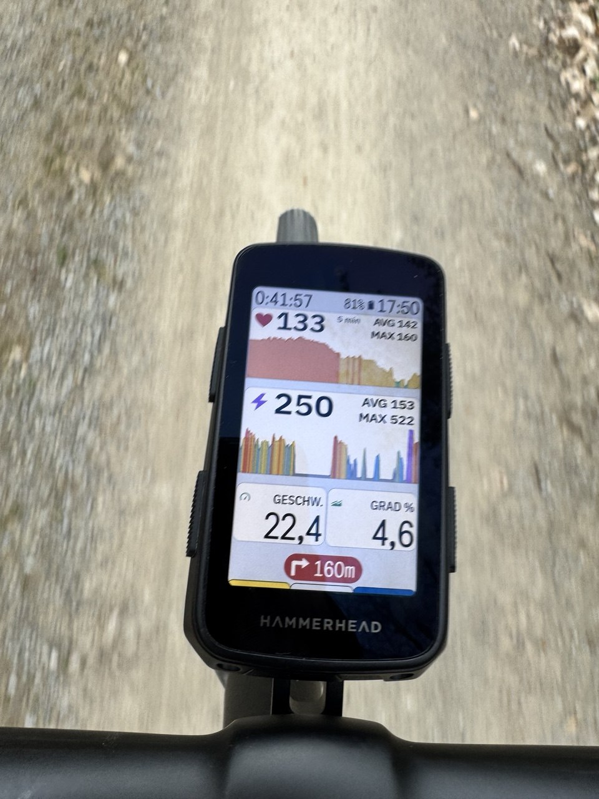

# sk0711-graph

A [Hammerhead Karoo](https://hammerhead.io/) extension that adds two graphical data fields showing the recent history of heart rate and power as a zone-colored curve — Garmin Edge style.

Tested on Karoo 3, compatible with Karoo 2.

<p align="center">
  
</p>

## Features

- **HR Zone Graph** and **Power Zone Graph** as separate graphical data fields.
- Curve color follows the Karoo zone of each sample (5 HR zones, 7 power zones).
- Current value, average, and max shown alongside the curve. AVG/MAX are read from the Karoo's own streams (`AVERAGE_HR`, `MAX_HR`, `AVERAGE_POWER`, `MAX_POWER`) so they match the values other data fields on the same page display.
- **Tap a field** to cycle its time window: 1 min → 5 min → Full ride. Each field keeps its own window.
- Power curve uses a 3-second rolling average (HR is not smoothed).

## Install

Download `sk0711-graph-0.1.3-debug.apk` from the [Releases](../../releases) page.

> The released APK is a **debug build** — signed with Android's generic debug key rather than a stable release key. This is standard practice for sideloaded Karoo extensions and means the file name ends in `-debug.apk`. It is fully functional; the `-debug` suffix is a packaging detail, not a quality signal. If the signing story changes in a future release, it will be noted here.

**Karoo 3:** share the APK link via the Companion app, or install via ADB over USB.
**Karoo 2:** install via ADB:

```
adb install -r sk0711-graph-0.1.3-debug.apk
```

Then in the Karoo ride-page editor, open the data field picker, find **sk0711-graph**, and add **HR Zone Graph** and/or **Power Zone Graph** to a page.

## Usage

- Tap the field to cycle the visible time window (1 min → 5 min → Full).
- Zones come from the Karoo's own HR-zone and power-zone configuration (set under the rider profile).

## Known issues

- Tap-to-toggle sometimes does not react or reacts with a delay. A tap may be missed entirely or the window may cycle only after a short pause. Tap again if nothing happens.
- Layout scaling is not yet ideal: at certain field heights/widths, the **1min / 5min / Full** window label can be overlapped by the current HR or power value.

## Build from source

Requirements: Android Studio (Giraffe or later) and a GitHub Personal Access Token with `read:packages` scope — the `karoo-ext` SDK is hosted on GitHub Packages.

Add credentials to `local.properties`:

```
gpr.user=YOUR_GITHUB_USERNAME
gpr.key=YOUR_GITHUB_TOKEN
```

Then:

```
./gradlew assembleDebug
```

Output: `app/build/outputs/apk/debug/sk0711-graph-0.1.3-debug.apk`.

## License

[Apache License 2.0](LICENSE).
